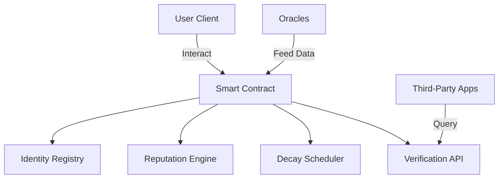

# Bitcoin Trust Score — Decentralized Reputation System for Stacks

A **trustless**, **on-chain**, and **self-sovereign reputation protocol** for the **Stacks blockchain**. This smart contract enables users to earn verifiable reputation scores from on-chain actions, with automated time-decay and transparency by design.

## Overview

* **Decentralized Identity (DID):** Each user controls their identity without a central authority.
* **Action-Based Scoring:** Reputation grows from predefined, weight-based activities (e.g., governance, contributions).
* **Decay System:** Scores naturally decline over time to maintain relevance.
* **Verifiable Reputation:** Third parties can query or validate scores for trust-based operations.

## Features

✅ **Self-Sovereign Identity**
📈 **Weighted Action-Based Reputation**
⏳ **Automated Time-Decay Algorithm**
🔍 **On-Chain Transparency & Auditing**
🛡️ **Battle-Tested Security Practices**
🧩 **Admin Configurability & Controls**

---

## 🧱 Architecture



### Core Modules

| Module                 | Responsibilities                                                              |
| ---------------------- | ----------------------------------------------------------------------------- |
| **Identity Registry**  | Stores DIDs, timestamps, status, and current scores                           |
| **Reputation Engine**  | Adds/removes scores, validates inputs, bounds values (0–1000)                 |
| **Decay Mechanism**    | Periodic score decay to prevent inflation and maintain recency                |
| **Action Registry**    | Admin-defined actions with multipliers and metadata                           |
| **Verification Layer** | Read-only queries and threshold-based validation for third-party interactions |

## ⚙️ Key Constants

| Constant                      | Description                     | Default  |
| ----------------------------- | ------------------------------- | -------- |
| `MAX-REPUTATION-SCORE`        | Maximum score cap               | `u1000`  |
| `DEFAULT-STARTING-REPUTATION` | Initial score upon DID creation | `u50`    |
| `DEFAULT-DECAY-RATE`          | Percentage decay per period     | `u10`    |
| `decay-period`                | Block interval for decay        | `u10000` |

Decay formula:

```
new-score = current-score - (current-score * decay-rate / 100)
```

---

## 💡 Example Workflow

```clojure
;; Step 1: Create identity
(create-identity "did:btc:user123")

;; Step 2: Perform an action and gain reputation
(update-reputation-score "governance-vote")

;; Step 3: Apply decay (if interval has passed)
(decay-reputation)

;; Step 4: Verify score against a threshold
(verify-reputation tx-sender u200)
```

---

## 🔑 Key Functions

### User Operations

```clojure
(define-public (create-identity (did (string-ascii 50))))
(define-public (update-reputation-score (action-type (string-ascii 50))))
(define-read-only (get-reputation (owner principal)))
(define-read-only (verify-reputation (user principal) (min-score uint)))
```

### Admin Functions

```clojure
(define-public (add-reputation-action
  (action-type (string-ascii 50))
  (multiplier uint)
  (description (string-ascii 100)))

(define-public (set-decay-parameters
  (new-rate uint)
  (new-period uint)))

(define-public (set-contract-active (active bool)))
```

---

## 🔒 Security Model

* **Role-Based Access Control:** Admin-only modification of config and action types
* **Immutable History:** All score changes are logged on-chain
* **Anti-Gaming Protections:** Score decay, cooldowns, and action ceilings
* **Failsafe Mechanisms:** Contract can be paused in emergencies

## 📦 Use Cases

* **DAO membership scoring** & **reputation-gated proposals**
* **Vendor trust scores** in decentralized marketplaces
* **Reputation-driven airdrops** and incentives
* **On-chain resumes** for hiring or grants
* **Community contribution rewards**

## 🛠 Installation & Usage

### Prerequisites

* Clarinet v2.0+
* Node.js 18+
* Stacks.js v6.x

### Quickstart

```bash
git clone https://github.com/yourorg/bitcoin-trust-score
cd bitcoin-trust-score
clarinet console
::> (contract-call? .btc-trust create-identity "user123")
::> (contract-call? .btc-trust update-reputation-score "governance-vote")
```

## 🤝 Contributions

Contributions are welcome!

1. Fork the repo
2. Make your changes (with tests)
3. Open a Pull Request
